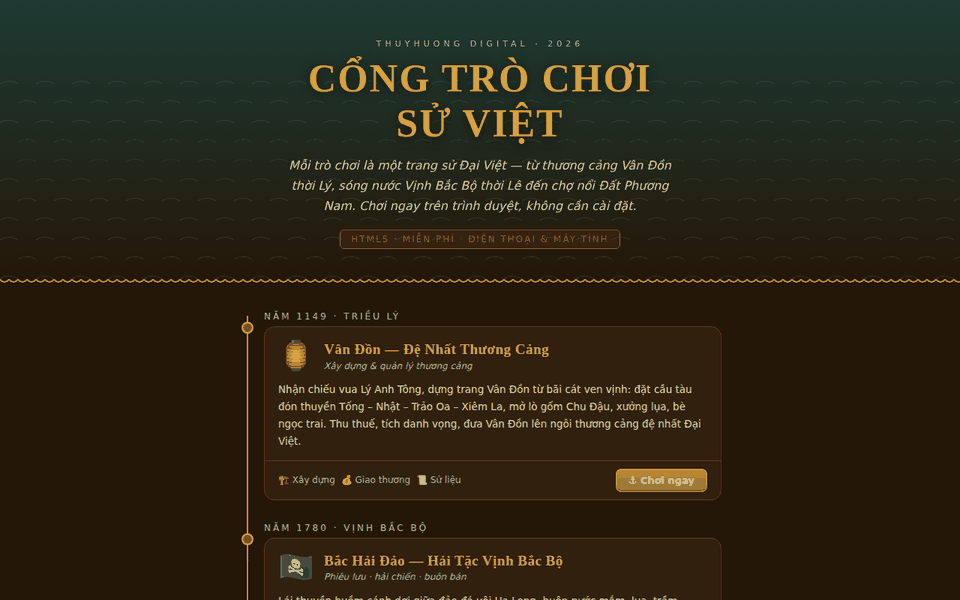
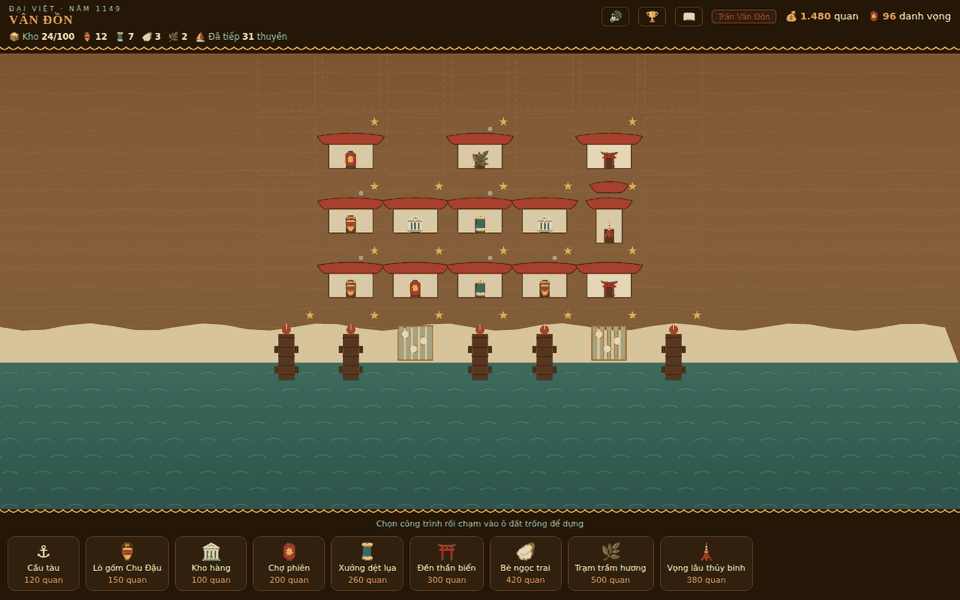
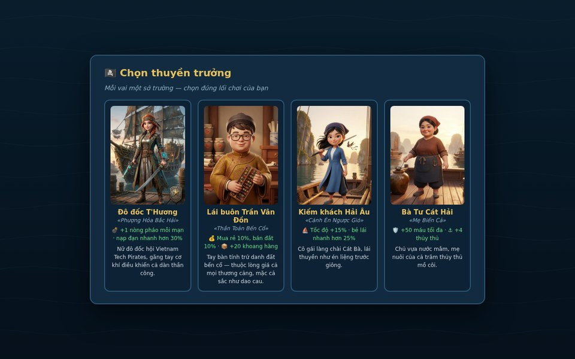
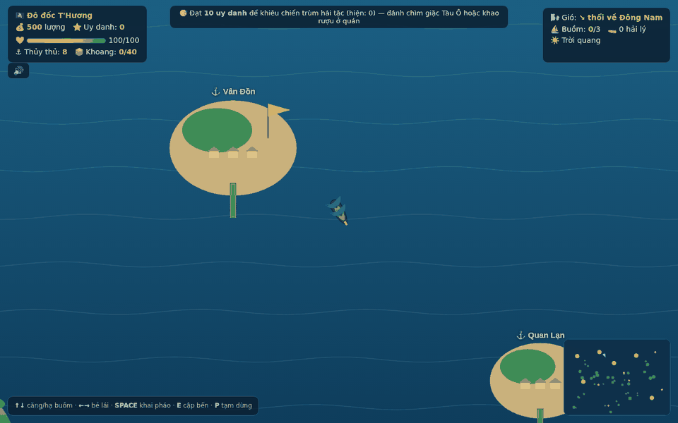
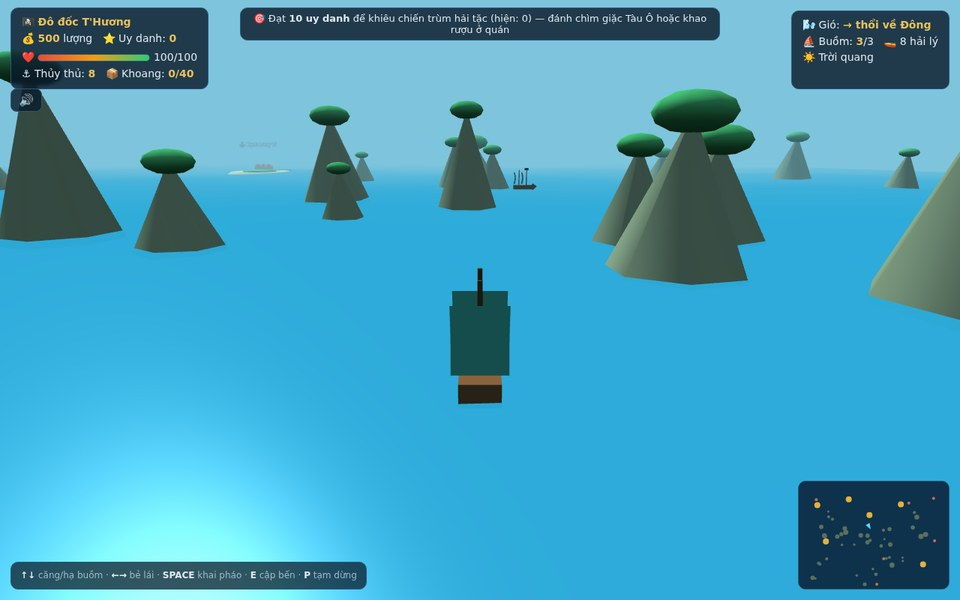
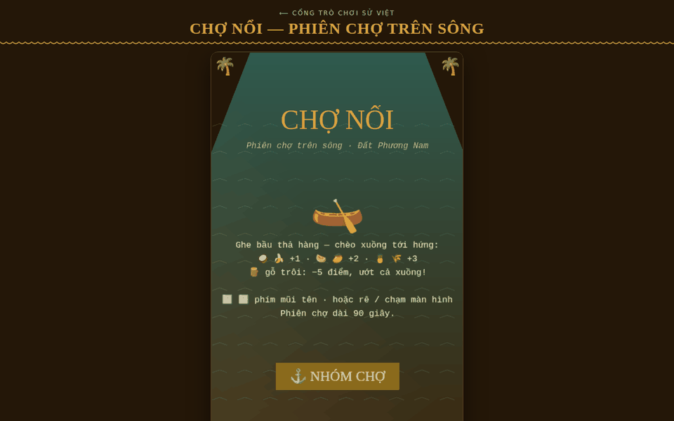

<div align="center">

# ThuyHuong Digital 2026 — Games

### Cổng Trò Chơi Sử Việt · *Vietnamese History Game Portal*

A collection of browser-based educational games set in documented periods of
Vietnamese history, published as an installable, offline-capable web application.

[](https://github.com/thuyhuongctu/ThuyHuong_Digital-2026-Games/releases)
[](https://doi.org/10.5281/zenodo.21850564)
[](https://thuyhuongctu.github.io/ThuyHuong_Digital-2026-Games/)
[](LICENSE)
[](bac-hai-dao-3d/)
[](cho-noi/)

**[▶ Play now: thuyhuongctu.github.io/ThuyHuong_Digital-2026-Games](https://thuyhuongctu.github.io/ThuyHuong_Digital-2026-Games/)**

*No installation, no account, no advertising, no data collection.*

</div>

---

## Contents

- [Overview](#overview)
- [Screenshots](#screenshots)
- [The games](#the-games)
- [Educational use](#educational-use)
- [Features](#features)
- [Getting started](#getting-started)
- [Repository structure](#repository-structure)
- [Implementation notes](#implementation-notes)
- [Privacy](#privacy)
- [Releases and archiving](#releases-and-archiving)
- [How to cite](#how-to-cite)
- [License and third-party components](#license-and-third-party-components)
- [Author and contact](#author-and-contact)

## Overview

**ThuyHuong Digital 2026 — Games** is a portal of four history-themed HTML5
games covering three periods of Vietnamese history: the maritime trading port
of Vân Đồn under the Lý dynasty (1149), piracy and coastal trade in the Gulf
of Tonkin (1780), and the floating markets of the Mekong Delta during the
nineteenth-century settlement of the southern provinces.

The portal homepage presents the games as a chronological timeline and applies
a single visual identity derived from Lý–Trần dynasty ceramic colours. Each
game is a self-contained `index.html` file that requires no build step, no
server-side component, and no account. The portal is a Progressive Web App:
once loaded it can be installed to a device home screen, runs full screen, and
remains playable without a network connection.

The project is developed and maintained by a single author as a free,
non-commercial contribution to Vietnamese-language educational resources on
the web. It is free to play and to teach with, but it is not open-source
software: see [License](#license-and-third-party-components).

## Screenshots

<table>
<tr>
<td width="50%"></td>
<td width="50%"></td>
</tr>
<tr>
<td><b>Portal</b> — the games on a chronological timeline, in a shared visual identity drawn from Lý–Trần ceramics.</td>
<td><b>Vân Đồn (1149)</b> — the port after several rounds of construction: piers, Chu Đậu kilns, silk workshops, shrines and a naval watchtower.</td>
</tr>
<tr>
<td></td>
<td></td>
</tr>
<tr>
<td><b>Bắc Hải Đảo (1780)</b> — four playable captains, each with distinct starting conditions and abilities.</td>
<td><b>Bắc Hải Đảo (1780)</b> — sailing between historic ports, with wind, weather, cargo and reputation tracked on the interface.</td>
</tr>
<tr>
<td></td>
<td></td>
</tr>
<tr>
<td><b>Bắc Hải Đảo 3D (1780)</b> — the same world under a chase camera, with limestone karsts, sea surface and weather rendered in three dimensions.</td>
<td><b>Chợ Nổi (19th century)</b> — a ninety-second market session on the canals of the Mekong Delta.</td>
</tr>
</table>

## The games

| | Game | Period | Genre | Play |
|---|---|---|---|---|
| 🏮 | **Vân Đồn** — The First Trading Port | 1149 | City building, port management | [Play](https://thuyhuongctu.github.io/ThuyHuong_Digital-2026-Games/van-don/) · [Guide](van-don/README.md) |
| 🏴‍☠️ | **Bắc Hải Đảo** — Pirates of the Gulf of Tonkin | 1780 | Adventure, trading, naval combat | [Play](https://thuyhuongctu.github.io/ThuyHuong_Digital-2026-Games/bac-hai-dao/) · [Guide](bac-hai-dao/README.md) |
| 🌊 | **Bắc Hải Đảo 3D** | 1780 | The same world rendered in 3D | [Play](https://thuyhuongctu.github.io/ThuyHuong_Digital-2026-Games/bac-hai-dao-3d/) · [Guide](bac-hai-dao-3d/README.md) |
| 🛶 | **Chợ Nổi** — Floating Market | 19th century | Arcade, reaction and timing | [Play](https://thuyhuongctu.github.io/ThuyHuong_Digital-2026-Games/cho-noi/) · [Guide](cho-noi/README.md) |

### Vân Đồn — The First Trading Port (1149)

In 1149 King Lý Anh Tông issued an edict establishing Vân Đồn, the first
international trading port of Đại Việt. The player develops the port from a
fishing hamlet: building piers for merchant ships arriving from Song China,
Japan, Java and Siam; opening Chu Đậu pottery kilns, silk workshops and pearl
rafts; collecting tax revenue; weathering storms; and repelling raids. The game
includes tiered building upgrades, royal tribute quests, an in-game history
codex, an achievements board, and a separate challenge mode recreating the
Battle of Vân Đồn (1288), in which Trần Khánh Dư intercepted the Yuan supply
fleet.

### Bắc Hải Đảo — Pirates of the Gulf of Tonkin (1780)

A maritime adventure set among the limestone karsts of Hạ Long Bay. The player
sails a bat-wing junk between six historic ports, trades fish sauce, silk,
agarwood and pearls, engages Tàu Ô pirate vessels, survives storms, and
ultimately confronts the pirate lord Hắc Giao. Four playable captains provide
distinct starting conditions and abilities. Background music is generated in
real time on the Vietnamese pentatonic scale.

### Bắc Hải Đảo 3D (1780)

The same world rebuilt in three dimensions with three.js: a chase camera behind
the junk, animated sea surface, limestone islands, three-dimensional ports and
enemy vessels, storm weather, and the Dragon of Hạ Long. All gameplay systems
of the two-dimensional version are retained. Both versions remain available so
that the portal continues to work on low-powered devices.

### Chợ Nổi — Floating Market (19th century)

An arcade game set in the floating markets that formed along the canals of the
Mekong Delta as settlers opened up the southern provinces. A merchant barge
crosses the river releasing produce; the player steers a sampan (*xuồng ba lá*)
to catch coconuts, bananas, watermelons, mangoes, pineapples and rice (one to
three points each) while avoiding driftwood (minus five points). A market
session lasts ninety seconds and the drop rate increases progressively. This is
the first game in the portal built on the Phaser 3 engine.

## Educational use

The games are intended for secondary and undergraduate teaching, for
self-directed learning, and for informal use by general audiences interested in
Vietnamese history. They run on shared or low-specification school computers
and on mobile phones, and continue to work offline after the first load, which
makes them usable in classrooms without reliable internet access.

Historical settings, place names, trade goods and events are drawn from
well-documented episodes of Vietnamese history and are presented in an
accompanying in-game codex. The games are nevertheless works of interactive
fiction: mechanics, difficulty balance and narrative details are designed for
playability and should not be treated as a scholarly source.

## Features

- **Four complete games** sharing a single visual identity and historical frame
- **Installable Progressive Web App**: home-screen installation, full-screen
  presentation, and complete offline operation through a service worker,
  web manifest and icon set
- **Generative audio**: background music synthesised in real time with the
  Web Audio API on the Vietnamese pentatonic scale, emulating *đàn tranh*
  plucked strings and *đàn bầu* pitch bends; no audio files are shipped
- **Desktop and mobile input**: keyboard control on desktop, touch control on
  phones and tablets
- **Local progress storage**: saved games and high scores are held in browser
  storage on the device only
- **Bilingual interface material**: game text in Vietnamese, documentation and
  store listings in Vietnamese and English

## Getting started

### Play online

Open the [portal](https://thuyhuongctu.github.io/ThuyHuong_Digital-2026-Games/)
in any modern browser. On a mobile device, select **Install to Home Screen** to
obtain the full-screen offline application. On iOS, use Safari and choose
**Share → Add to Home Screen**.

### Requirements

A current version of Chrome, Edge, Firefox or Safari with JavaScript enabled.
No installation, account, plug-in or build toolchain is required. The 3D
edition benefits from WebGL hardware acceleration; the 2D editions do not
require it.

### Run locally

```bash
git clone https://github.com/thuyhuongctu/ThuyHuong_Digital-2026-Games.git
cd ThuyHuong_Digital-2026-Games
python3 -m http.server 8000     # then open http://localhost:8000
```

The games also run when `index.html` is opened directly from the file system.
Serving the directory over HTTP is required only for the service worker and the
installation prompt.

### Deployment

The repository is the deployable site. Any static host will serve it; the
published instance is hosted on GitHub Pages, and each push to the default
branch is deployed automatically. Guidance on wrapping the Progressive Web App
for Google Play as a Trusted Web Activity, and on preparing store listings, is
given in [`HUONG-DAN-PHAT-HANH.md`](HUONG-DAN-PHAT-HANH.md) (in Vietnamese).

## Repository structure

```
.
├── index.html               Portal homepage (chronological timeline)
├── van-don/                 Vân Đồn: port building (1149)
├── bac-hai-dao/             Bắc Hải Đảo: pirate adventure, 2D (1780)
├── bac-hai-dao-3d/          Bắc Hải Đảo 3D: three.js edition
├── cho-noi/                 Chợ Nổi: floating market, Phaser 3 (19th century)
├── lib/three.min.js         Vendored three.js r147
├── assets/vendor/           Vendored Phaser 3.90.0 and its licence
├── icons/                   Application icon set (192, 512, maskable)
├── docs/screenshots/        Screenshots used in this document
├── store-assets/            Store listings and promotional graphics
├── manifest.webmanifest     Web application manifest with per-game shortcuts
├── sw.js                    Service worker (cache-first offline strategy)
├── privacy.html             Privacy policy, Vietnamese and English
├── HUONG-DAN-PHAT-HANH.md   Release and store-submission guide (Vietnamese)
├── CITATION.cff             Citation metadata for GitHub and Zenodo
└── .zenodo.json             Archival metadata Zenodo reads on each release
```

## Implementation notes

| Layer | Implementation |
|---|---|
| 2D games (Vân Đồn, Bắc Hải Đảo) | HTML5 canvas and vanilla JavaScript, one self-contained file per game |
| 3D game (Bắc Hải Đảo 3D) | [three.js](https://threejs.org/) r147, vendored locally |
| 2D game engine (Chợ Nổi) | [Phaser 3](https://phaser.io/) v3.90.0, vendored locally |
| Audio | Web Audio API, generative pentatonic music, no audio assets |
| Application platform | Progressive Web App: manifest, service worker, shortcuts |
| Persistence | Browser `localStorage`, device-local only |
| Distribution | GitHub Pages; Trusted Web Activity wrapper for Google Play; home-screen installation on iOS |
| Archiving | Each release is deposited in [Zenodo](https://doi.org/10.5281/zenodo.21850564) with a DOI |

The project uses no build tooling and no content delivery networks. The two
external libraries are vendored into the repository so that the application
remains fully functional offline and so that each archived release is complete
and independently executable.

**Engine selection.** Phaser 3 was adopted for new 2D work after evaluating a
range of open-source game engines. It is a single-file, MIT-licensed JavaScript
library that runs directly from a static host without a build step and is
actively maintained. Editor-centred engines (Godot, Cocos, GDevelop) were not
adopted because they require an export pipeline; engines targeting the Java, C#
or C++ toolchains (libGDX, MonoGame, jMonkeyEngine, Torque3D, Spring, gameplay3d,
OpenRTS) are not deployable as a static website; Babylon.js was not adopted
because the portal already vendors three.js for 3D work; and several browser
engines considered (Starling, Turbulenz, Crafty, whs.js, Superpowers, Atomic)
are no longer maintained.

## Privacy

The application collects no personal data. It has no analytics, no advertising,
no third-party requests at runtime, and no server-side component. Saved games
and high scores are written to browser storage on the user's own device and can
be removed by clearing site data. The full policy is provided in
[`privacy.html`](privacy.html).

## Releases and archiving

Releases are tagged in GitHub and deposited automatically in Zenodo, where each
release receives its own version DOI in addition to the concept DOI that
represents the project as a whole. The archived record is the citable version
of record.

## How to cite

[](https://doi.org/10.5281/zenodo.21850564)

The author of record is **Do Thuy Huong** (Đỗ Thùy Hương). Citation metadata is
maintained in
[`CITATION.cff`](CITATION.cff), from which GitHub's **Cite this repository**
control exports APA and BibTeX, and in [`.zenodo.json`](.zenodo.json), which
Zenodo reads when it archives each release.

> Do, T. H. (2026). *ThuyHuong Digital 2026 — Games: Cổng Trò Chơi Sử Việt
> (Vietnamese History Game Portal)* [Computer software]. Zenodo.
> https://doi.org/10.5281/zenodo.21850564

```bibtex
@software{do_thuyhuong_digital_games_2026,
  author    = {Do, Thuy Huong},
  title     = {{ThuyHuong Digital 2026 --- Games: Cổng Trò Chơi Sử Việt
               (Vietnamese History Game Portal)}},
  year      = {2026},
  publisher = {Zenodo},
  doi       = {10.5281/zenodo.21850564},
  url       = {https://doi.org/10.5281/zenodo.21850564}
}
```

The DOI above is the **concept DOI**, which represents all versions and always
resolves to the most recent release. Individual releases carry their own DOIs:

| Version | DOI |
|---|---|
| 1.2 (latest) | [10.5281/zenodo.21899097](https://doi.org/10.5281/zenodo.21899097) |
| 1.1 | [10.5281/zenodo.21898774](https://doi.org/10.5281/zenodo.21898774) |
| 1.0 | [10.5281/zenodo.21850565](https://doi.org/10.5281/zenodo.21850565) |

## License and third-party components

**© 2026 Do Thuy Huong (Đỗ Thùy Hương). All rights reserved.** See
[`LICENSE`](LICENSE) for the full bilingual terms.

The games are published to be played, taught with and cited, not to be reused
as source material. Playing the games at the official address, non-commercial
classroom use by teachers and institutions, reading the source for personal
learning, academic citation with attribution and the DOI, and screenshots or
review videos with credit are all permitted without prior permission.
Redistribution, re-deployment, modification, derivative works, extraction of
artwork or music, publication to application stores, fee-charging use, and use
as training data for commercial AI systems require the author's prior written
permission.

Licensing enquiries: [thuyhuongctu@gmail.com](mailto:thuyhuongctu@gmail.com)

Vendored third-party libraries are excluded from the reservation above and
retain their own licences:

| Component | Version | Licence |
|---|---|---|
| [Phaser](https://phaser.io/) | 3.90.0 | MIT ([`assets/vendor/PHASER-LICENSE.md`](assets/vendor/PHASER-LICENSE.md)) |
| [three.js](https://threejs.org/) | r147 | MIT |

## Author and contact

**Do Thuy Huong** (Đỗ Thùy Hương), ThuyHuong Digital.

Correspondence: [thuyhuongctu@gmail.com](mailto:thuyhuongctu@gmail.com)

Issues and suggestions are welcome through the repository
[issue tracker](https://github.com/thuyhuongctu/ThuyHuong_Digital-2026-Games/issues).

---

<div align="center">

© 2026 Do Thuy Huong (ThuyHuong Digital). Further games are planned during 2026.

</div>
